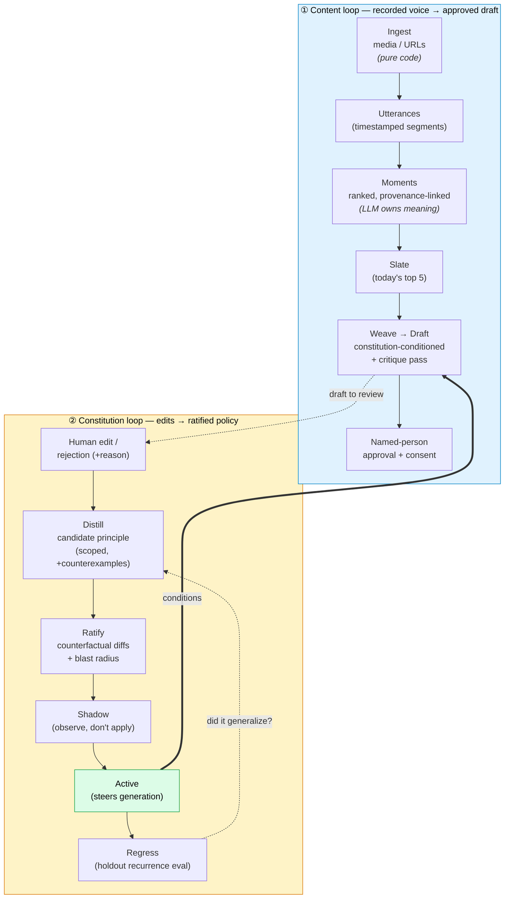
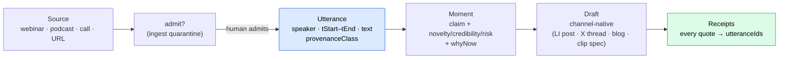
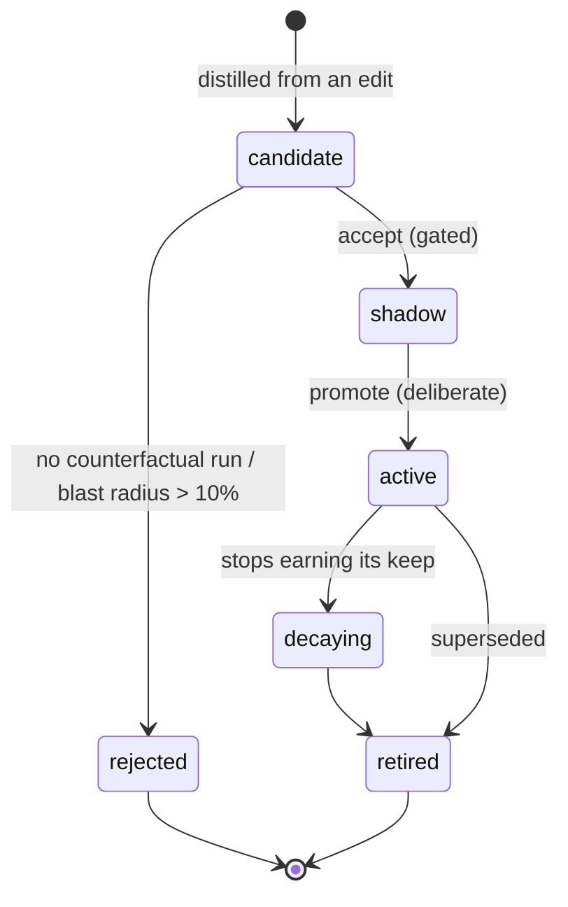
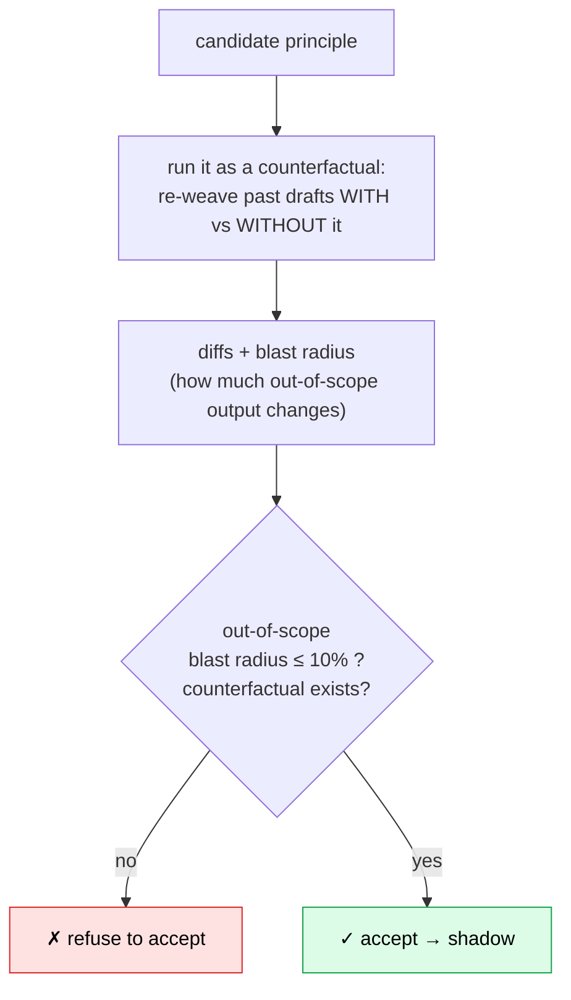
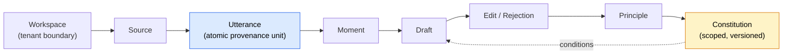

<div align="center">

# NovelFusion

**A governed editorial memory system — with generation attached.**

*Turn an organization's recorded voice into approved, provenance-backed marketing content — and turn every human editorial decision into a versioned, regression-tested **editorial constitution**.*

> **Every edit you make becomes policy.**

</div>

---

## The idea in one breath

Most AI marketing tools generate fluent copy and stop there. The copy drifts off-voice, someone edits it, and that edit — the actual signal of what "on-brand" means — is **thrown away**. Next week the model makes the same mistake.

NovelFusion keeps it. Every edit and rejection is distilled into a **scoped, ratified principle** and added to a living **constitution** that conditions all future generation. The product isn't the copy; it's the *governed memory of your editorial judgment* — with receipts on every claim, named-person approval, a consent ledger, and one-click rollback.

- 📄 Product spec: [`docs/PRD.md`](docs/PRD.md)
- 🧭 Strategy record (panel decisions, market research, gate criteria): [`docs/SYNTHESIS.md`](docs/SYNTHESIS.md)
- 🤖 Agent operating rules: [`CLAUDE.md`](CLAUDE.md)

**Positioning — anti-slop infrastructure.** As AI text floods every feed and disclosure laws force "AI-generated" labels onto synthetic media, *"provably said by a real human, on the record, approved"* becomes the scarce good. That's what NovelFusion manufactures.

---

## The two loops

The whole system is two loops sharing one substrate. The **content loop** (blue) turns recorded voice into drafts. The **constitution loop** (amber) turns human edits on those drafts into policy that steers the content loop. The second loop is the moat — it's what makes the system *learn your voice instead of just decorating it*.



---

## Loop ①: recorded voice → publishable draft, with receipts

Every claim in every draft resolves to a **timestamped human utterance** — not a brand-guideline paraphrase, not a hallucination. Provenance is *structural*: hallucinated utterance IDs are dropped in code, and a public-web segment can never satisfy a person-consent requirement.



**Provenance tiers (the moat-guard).** Human utterances are the *primary* grounding; owned documents and public web are *supporting* only — and drive receipt weight. Consent is a code path, not a prompt: nothing ships in a person's name without their approval.

---

## Loop ②: the editorial constitution

This is the differentiator. A constitution is a set of **principles**, each *scoped* (which formats/channels/audiences it governs) and *tiered* by authority. Principles are never accepted on prose — they're ratified against **behavior**.

### A principle's life



### Ratification is gated on behavior, not opinion



### Principle tiers (authority)

| Tier | Governs | Example |
|---|---|---|
| **L0 compliance** | legal/consent hard limits | never quote a named customer without consent |
| **L1 brand** | voice & positioning | lead with the customer's outcome, not our feature |
| **L2 channel** | format conventions | LinkedIn posts open with a one-line hook |
| **L3 taste** | fine editorial preference | prefer "teams" over "organizations" |

---

## How the loop enforces its own rules

These are code paths and gates, not prompt suggestions:

- **Ratification gated on behavior** — `nf accept` refuses a principle with no counterfactual run, or whose out-of-scope blast radius exceeds **10%**.
- **Shadow before live** — accepted principles enter `shadow` (observed, not applied); `promote` to `active` is a separate, deliberate step.
- **Holdout discipline (no eval contamination)** — ~30% of drafts are auto-marked holdout; holdout edits are **never** distilled and **never** retrieved as exemplars. They exist only to measure generalization (`nf regress`).
- **Provenance is structural** — hallucinated utterance IDs are dropped in code; consent gating and tenancy isolation are code paths.
- **Everything is traced** — every model call → `data/traces.jsonl` (stage, model, usage); every eval records model + constitution version + git SHA, so any result re-runs.

> **Design discipline (shared across the codebase): code owns structure, the model owns meaning.** Ingest, diffing, blast-radius, scope, tenancy, provenance resolution → deterministic code. What a moment *means*, whether a draft is *on-voice*, which principle an edit *implies* → the LLM. Neither does the other's job.

---

## Quick start

```bash
npm install
cp .env.example .env      # add ANTHROPIC_API_KEY
npm run typecheck && npm test
```

The Phase 0 loop, end to end (CLI is the "spreadsheet-grade" review surface):

```bash
npm run nf -- --workspace demo init
npm run nf -- --workspace demo ingest samples/demo-webinar.txt
npm run nf -- --workspace demo extract          # LLM: transcript → ranked moments
npm run nf -- --workspace demo slate            # today's slate (top 5)
npm run nf -- --workspace demo weave <momentId> --format li_post
npm run nf -- --workspace demo show <draftId> --out /tmp/draft.txt
#   ...edit /tmp/draft.txt as a human editor would...
npm run nf -- --workspace demo edit <draftId> --file /tmp/draft.txt --reason off-voice
npm run nf -- --workspace demo distill          # LLM: edits → candidate principles
npm run nf -- --workspace demo ratify           # LLM: counterfactual diffs + blast radius → reports/
npm run nf -- --workspace demo accept <principleId>    # → shadow (blocked if blast radius >10%)
npm run nf -- --workspace demo promote <principleId>   # → active
npm run nf -- --workspace demo regress          # LLM: recurrence eval on holdout pairs
npm run nf -- --workspace demo report           # gate metrics vs. pre-registered thresholds
```

---

## Status: Phase 0 (bench prototype)

This repo implements the **pre-registered Phase 0 experiment** — the headless distillation loop that decides whether the company gets built (kill/proceed criteria in `SYNTHESIS.md` §4). It is a headless pipeline with markdown/CLI review surfaces, **on purpose** — no product UI ahead of the gate. The question Phase 0 answers: *does the constitution loop demonstrably reduce recurring edits on held-out drafts?*

**Non-goals (panel-decided constraints, not TODOs):** no private-chat (Slack/Teams) ingestion; no synthetic avatars / voice cloning (real-footage clip specs only); no in-app video rendering. Provenance and consent gating are never optional.

---

## Data model (Phase 0 subset)



---

## Layout

```text
src/
  cli.ts                  # Phase 0 CLI (the PRD's "spreadsheet-grade UI")
  config.ts               # env config + feature flags (default OFF)
  domain/types.ts         # core entities (PRD §7 subset)
  db/                     # SQLite (better-sqlite3); schema.sql; workspace-scoped queries only
  llm/client.ts           # the single Claude chokepoint: model, structured outputs, caching, traces
  pipeline/
    ingest.ts             # transcripts → utterances (pure code)
    moments.ts            # utterances → ranked moments (LLM owns meaning)
    weave.ts              # moment → stubs → constitution-conditioned draft (+critique pass)
    edits.ts              # human edit capture (distiller signal, exemplar store)
    distill.ts            # edits → scoped candidate principles (+counterexamples)
    counterfactual.ts     # candidate → diffs + blast radius → ratification report
  eval/harness.ts         # recurrence eval: constitution-on vs. baseline on holdouts
  report/gate.ts          # Phase 0 gate metrics vs. thresholds
test/                     # pure-code units (parsing, diffing, blast radius)
samples/                  # fictional demo transcript
```

---

## Why this is defensible

| Others | NovelFusion |
|---|---|
| Interview execs to *manufacture* source material | Mine the recorded material that already exists — **with receipts** |
| Ground generation in brand guidelines / documents | Ground in **timestamped human utterances** + named-person approval |
| Learn brand voice from static config | **Learn policy from edits** — every correction becomes a ratified, scoped principle |
| Repurpose mechanically, cheaply | Add the **governance layer** (consent, approval, constitution, audit) that makes output enterprise-publishable |

The constitution — a portfolio of an organization's ratified editorial judgment — is the switching cost and the compounding asset. It can't be copied by prompt.
