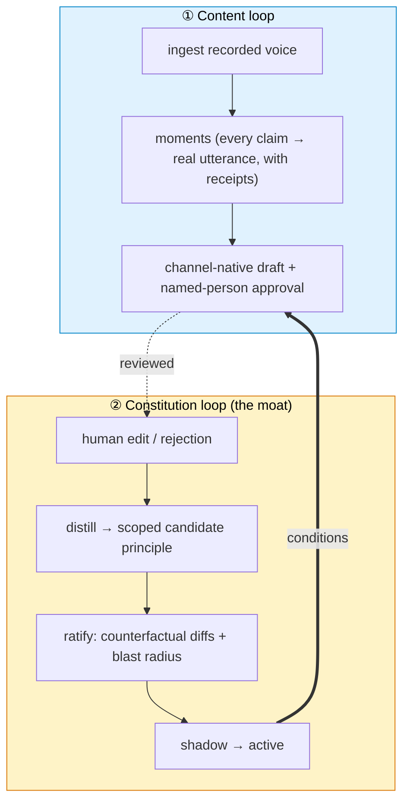

# NovelFusion: What if every edit you made became policy?

*Repo: https://github.com/4sgupta828/novelfusion · a governed editorial memory system with generation attached · ratify principles against behavior, not prose*

---

## An industry problem hiding in plain sight

Every marketing team owns a goldmine of authentic voice — webinars, podcasts, customer calls, founder talks. And every team throws away the single most valuable signal in content operations: **the edit.**

An AI drafts a post, it's off-voice, an editor fixes it — and that correction, the actual encoding of "what on-brand means here," evaporates. Next week the model makes the same mistake. You're renting fluency and re-teaching taste forever.

Meanwhile the ground is shifting: AI text is flooding every feed, and disclosure laws (EU AI Act, **Article 50**) are forcing "AI-generated" labels onto synthetic media. Soon the scarce good won't be *more* content — it'll be **"provably said by a real human, on the record, approved."**

## Framed as a research problem

| | |
|---|---|
| **Wasted signal** | Human edits — the highest-value training data in content ops — are discarded |
| **Goal** | Turn each edit/rejection into a *scoped, ratified principle* that conditions future generation |
| **The hard part** | Learn preferences that **generalize** without over-reaching — auditable and reversible, not a black-box reward model |
| **Central claim** | The product isn't the copy. It's the **governed memory of your editorial judgment** |

## The two loops



The trust mechanism: **principles are ratified against behavior, not prose.**

```text
candidate principle
  → run as a counterfactual: re-weave past drafts WITH vs WITHOUT it
  → measure out-of-scope "blast radius"
  → blast radius > 10%?  → REJECT (it corrupts unrelated content)
  → else → SHADOW (observe) → ACTIVE (steer)
holdout drafts are NEVER used to learn — only to measure generalization.
```

## What AI solves — and what must stay code

| Task | Owner |
|---|---|
| Extract the *meaningful* moment from an hour of transcript | **LLM** |
| Draft channel-native copy; infer which principle an edit implies | **LLM** |
| Provenance, consent, tenancy, blast-radius, scope | **Code** — a public-web quote can never satisfy a person-consent requirement |
| "Is this principle safe to accept?" | **Counterfactual gate**, not a judgment call |

## What stays genuinely hard (open problems)

1. **Scope inference** — turning a fuzzy edit into a rule that generalizes without over-reaching. Too broad → corrupts unrelated content; too narrow → trivia. This is the real research problem: *auditable, reversible preference learning.*
2. **Principle decay & conflict** — knowing when a rule has stopped earning its keep, and resolving contradictions between principles.
3. **Provenance under generation** — keeping every shipped claim tied to a real, consented human utterance.

## How to take it from here

- Treat the constitution as a **versioned, testable asset** with a regression suite — every principle carries a recurrence eval. That's the line between "learns from feedback" and "learns from feedback *safely.*"
- Retro-distill a starting constitution from published-content-vs-transcript diffs to onboard fast.

## Use cases → products

| Use case | Product shape |
|---|---|
| Agencies | A "constitution portfolio" per client as the retention moat |
| Enterprise brand governance | Middleware that sits under any content tool |
| The disclosure era | A provenance/consent layer for mandatory AI-content labeling |

## To understand this space better

**Constitutional AI** · RLHF & preference learning · **C2PA** / content provenance · the **EU AI Act (Article 50)** · controllable generation & style transfer.

---

*The durable asset in AI content isn't the generator — it's the governed memory of human judgment that steers it.*

**#AI #ContentOps #MarketingAI #GenAI #BrandGovernance #Provenance #GTM #ProductManagement**
