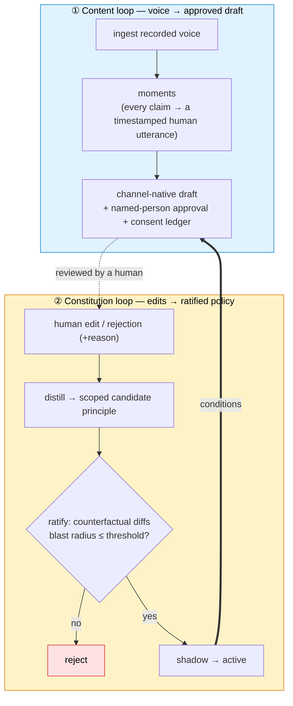

# NovelFusion: What if every edit became policy? Engineering a governed editorial memory

*Repo: https://github.com/4sgupta828/novelfusion · a governed editorial memory system with generation attached · principles ratified against behavior, not prose*

> **TL;DR for CMOs, heads of content, and anyone selling into them:** Every marketing team owns a goldmine of authentic voice — webinars, podcasts, customer calls — and throws away the single most valuable signal in content ops: the *edit*. An AI drafts, it's off-voice, an editor fixes it, and that correction — the actual encoding of "on-brand" — evaporates. NovelFusion keeps it. Every edit and rejection is distilled into a *scoped, ratified principle* and added to a living **editorial constitution** that steers all future generation. The product isn't the copy; it's the governed memory of your editorial judgment — with receipts on every claim, named-person approval, and a consent ledger. And the trust mechanism is the interesting part: **principles are ratified against behavior, not prose.**

---

## 1. The problem, stated the way a Head of Content would

You're not short on content. You're short on content that's *on-voice, defensible, and approved.* Two structural problems make that hard:

1. **The wasted signal.** The highest-value training data in content ops — human edits — is discarded every cycle. You rent fluency from a model and re-teach it taste forever.
2. **The rising bar.** AI text is flooding every feed, and disclosure laws (EU AI Act, Article 50) are forcing "AI-generated" labels onto synthetic media. Soon the scarce good isn't *more* content — it's **"provably said by a real human, on the record, approved."**

## 2. The thesis: two loops, and the second one is the moat



The content loop turns recorded voice into drafts with **structural provenance** — every claim in a draft resolves to a real, timestamped human utterance, and a public-web segment can *never* satisfy a person-consent requirement. Consent and tenancy are code paths, not prompts.

The **constitution loop** is the defensible asset. Every edit becomes a candidate principle — but a candidate doesn't become policy because it sounds right.

## 3. The mechanism that makes it trustworthy: ratify against behavior

A principle is *scoped* (which formats/channels/audiences it governs) and *tiered* by authority:

| Tier | Governs | Example |
|---|---|---|
| **L0 compliance** | legal / consent hard limits | never quote a named customer without consent |
| **L1 brand** | voice & positioning | lead with the customer's outcome, not our feature |
| **L2 channel** | format conventions | a LinkedIn post opens with a one-line hook |
| **L3 taste** | fine editorial preference | prefer "teams" over "organizations" |

And it's ratified by *running it*, not by reading it:

```text
candidate principle
  → run as a COUNTERFACTUAL: re-weave past drafts WITH vs WITHOUT it
  → measure out-of-scope "blast radius" (how much unrelated output changed)
  → blast radius > threshold?  → REJECT (it corrupts content it shouldn't touch)
  → else → SHADOW (observe, don't apply) → ACTIVE (steer generation)
holdout drafts are NEVER used to learn — only to measure generalization.
```

A principle's whole life is a state machine — `candidate → shadow → active → decaying → retired` — so a rule that stops earning its keep is demoted, not left to rot, and everything is reversible with one-click rollback.

## 4. Decisions and tradeoffs

| Decision | Alternative rejected | What we gave up | Why |
|---|---|---|---|
| Learn policy *from edits* | Static brand-guideline config | Simplicity | The edit is the highest-value signal; discarding it is the core waste |
| Ratify against behavior (counterfactual + blast radius) | Accept principles on prose | Speed | A rule that reads well can silently corrupt unrelated content; you must *measure* its reach |
| Shadow before live | Apply immediately | Time-to-effect | High-stakes generation needs an observation window before it steers |
| Holdout drafts, never used to learn | Use all data | Some training signal | Contaminated evals lie; holdout is the only honest measure of generalization |
| Structural provenance + consent as code | Prompt-level "please cite" | Flexibility | A hallucinated source ID must be *droppable in code*; consent can't be a suggestion |
| Scoped, tiered principles | One flat rulebook | Simplicity | Compliance and taste are not the same authority; scope prevents over-reach |

## 5. The AI-vs-deterministic-code boundary

- **Model owns meaning:** extract the *meaningful* moment from an hour of transcript, draft channel-native copy, infer which principle an edit *implies.*
- **Code owns structure & governance:** provenance resolution (hallucinated utterance IDs dropped), consent, tenancy, the blast-radius computation, scope enforcement, and the holdout split.

Ask the model to police consent and you've built a liability. Ask code to infer brand voice and you've built a keyword matcher that breaks on the next campaign. The boundary is the product.

## 6. How we know it works

The system is a *pre-registered* Phase-0 experiment — headless pipeline, CLI review surfaces, no product UI ahead of the gate — designed to answer one falsifiable question: **does the constitution loop demonstrably reduce recurring edits on held-out drafts?** Every principle carries a **recurrence eval**; every model call is traced (stage, model, usage); every eval records enough config to re-run it (model, constitution version, git SHA). That's the difference between "learns from feedback" and "learns from feedback *safely, and we can prove it.*"

## 7. What stays genuinely hard (open problems)

1. **Scope inference** — turning a fuzzy edit into a rule that generalizes without over-reaching. Too broad → corrupts unrelated content; too narrow → trivia. This is *auditable, reversible preference learning*, and it's the real research problem.
2. **Principle decay & conflict** — knowing when a rule has stopped earning its keep, and resolving contradictions between principles.
3. **Provenance under generation** — keeping every shipped claim tied to a real, consented utterance as volume scales.

## 8. How to take it from here

- Treat the constitution as a versioned, testable asset with a full regression suite.
- Retro-distill a starting constitution from published-content-vs-transcript diffs to onboard in under 48h.
- Close the loop to distribution feedback (engagement per asset) so the constitution learns what *works*, not just what's *on-voice.*

## 9. Use cases → products

| Use case | Product |
|---|---|
| Agencies | A "constitution portfolio" per client as the retention moat |
| Enterprise brand governance | Middleware under any content tool |
| The disclosure era | A provenance/consent layer for mandatory AI-content labeling |

## 10. The provocation

> **RLHF taught a generation of models to be agreeable, not correct** — we optimized for what sounds good to a rater and got *sycophancy at scale*. Brand-"voice" tools repeat the mistake one level up: they encode taste as static config and re-learn nothing from the single highest-value signal in the building — the human edit. Here's the uncomfortable part: your editors are already hand-labeling your best training data every single day, in the form of every correction they make, and you are *deleting it* the moment they hit save. The company that **keeps** those labels — and can prove a new rule generalizes *before* it ships, rather than discovering in production that it quietly rewrote a hundred unrelated posts — owns a compounding asset no prompt and no foundation model can copy. In a feed drowning in synthetic text, "provably human, on the record, approved" stops being compliance overhead and becomes the product.

## 11. Further reading (high-quality references)

- **Bai et al. (2022, Anthropic)** — "Constitutional AI: Harmlessness from AI Feedback." The idea of governing generation by an explicit, versioned constitution.
- **Ouyang et al. (2022)** — "Training Language Models to Follow Instructions with Human Feedback" (**InstructGPT**). *NeurIPS.* The RLHF baseline this critiques.
- **Perez et al. (2022, Anthropic)** — "Discovering Language Model Behaviors with Model-Written Evaluations." The sycophancy evidence.
- **Rafailov et al. (2023)** — "Direct Preference Optimization." *NeurIPS.* Learning from preferences, formalized.
- **C2PA** (c2pa.org) — the Coalition for Content Provenance and Authenticity standard.
- **EU AI Act** — Regulation (EU) 2024/1689, **Article 50** (transparency/AI-generated-content disclosure).
- Background: counterfactual evaluation · controllable generation & style transfer.

---

*The durable asset in AI content isn't the generator — it's the governed memory of human judgment that steers it, ratified against behavior and reversible by design.*

**#AI #ContentOps #MarketingAI #GenAI #BrandGovernance #Provenance #AIGovernance #GTM #ProductManagement**
